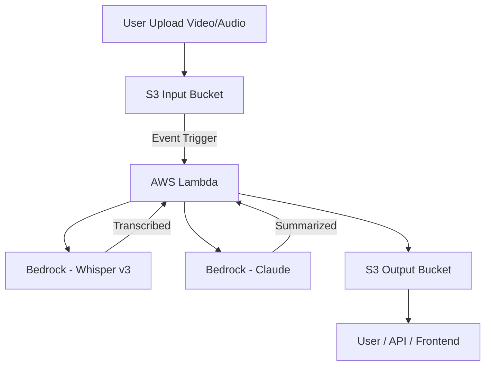

# 🎥 Video Highlight Generator - Architecture Draft

## 1. Overview

Video Highlight Generator adalah aplikasi berbasis AI yang membantu kreator konten mengekstrak highlight dari video/audio berdurasi panjang.  
Solusi ini menggunakan **Amazon Bedrock** (Whisper v3 untuk transkripsi & Claude untuk ringkasan) dengan pendekatan **serverless architecture** agar mudah di-scale dan hemat biaya.

---

## 2. High-Level Flow

1. **User Upload** → Pengguna mengunggah file video/audio ke **Amazon S3 (Input Bucket)**.
2. **Event Trigger** → Upload memicu **AWS Lambda** melalui event notification.
3. **Transcription** → Lambda memanggil **Whisper v3 (via Bedrock)** untuk menghasilkan transkrip teks.
4. **Summarization** → Teks hasil transkripsi diproses oleh **Claude (via Bedrock)** untuk mengekstrak highlight penting.
5. **Store Results** → Highlight disimpan di **Amazon S3 (Output Bucket)** dalam format teks (JSON/Markdown).
6. **Access Results** → Pengguna dapat mengunduh hasil ringkasan langsung dari S3 atau melalui API/Frontend (opsional).

---

## 3. Architecture Diagram (Mermaid)

---

## 4. Components

- **Amazon S3**
  - Input bucket: tempat file video/audio diunggah.
  - Output bucket: tempat hasil transkripsi & highlight disimpan.
- **AWS Lambda**
  - Menangani trigger event dari S3.
  - Memanggil model di Amazon Bedrock (Whisper & Claude).
  - Menyimpan hasil ke S3 output.
- **Amazon Bedrock**
  - **Whisper v3** → Automatic Speech Recognition (ASR).
  - **Claude** → Summarization & highlight extraction.
- _(Optional)_ **Amazon API Gateway**
  - Menyediakan endpoint API untuk mengakses pipeline secara real-time.
- _(Optional)_ **Frontend (React/Next.js)**
  - Antarmuka user-friendly untuk upload & membaca hasil.

---

## 5. MVP Scope (Hackathon)

Untuk lingkup MVP dalam Hackathon:

- Support upload audio/video ke S3.
- Pipeline otomatis → Transkripsi → Highlight.
- Simpan hasil di S3 (format JSON/Markdown).
- Dokumentasi & demo (misalnya link hasil di S3).
- Opsional: Tambahkan frontend sederhana untuk demo.

---
