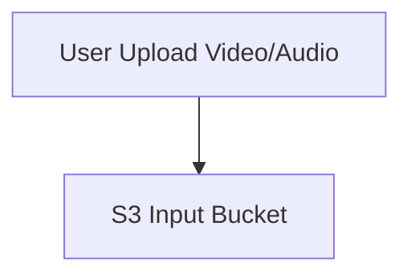

# 🎥 Video Highlight Generator - Architecture Draft

## 1. Overview

Video Highlight Generator adalah aplikasi berbasis AI yang membantu kreator konten mengekstrak highlight dari video/audio panjang.  
Pipeline ini memanfaatkan **AWS Bedrock** (Whisper v3 untuk transkripsi & Claude untuk ringkasan) dalam arsitektur **serverless** yang efisien.

---

## 2. High-Level Flow

1. **User Upload** → Pengguna mengunggah file video/audio ke **Amazon S3 (input bucket)**.
2. **Lambda Trigger** → Event upload memicu **AWS Lambda**.
3. **Transcription** → Lambda memanggil **Whisper v3 (via Bedrock)** untuk menghasilkan transkrip.
4. **Summarization** → Transkrip diproses oleh **Claude (via Bedrock)** untuk mengekstrak highlight.
5. **Store Results** → Hasil highlight (teks/audio/JSON) disimpan kembali di **Amazon S3 (output bucket)**.
6. **Access Results** → User dapat mengakses hasil ringkasan dari bucket output atau melalui API/Frontend (opsional).

---

## 3. Architecture Diagram (ASCII)

     +-------------+
     |   User      |
     | (Upload)    |
     +------+------+
            |
            v
    +-------+-------+
    |   Amazon S3   |  (Input Bucket)
    +-------+-------+
            |
    [Trigger Event]
            v
    +-------+-------+
    |    AWS Lambda |
    +---+-------+---+
        |       |
        |       |

---

## 4. Architecture Diagram (Mermaid)



---

5. Components

Amazon S3: Storage untuk file input/output.

AWS Lambda: Orchestrator serverless untuk trigger pipeline.

Amazon Bedrock (Whisper v3): Transkripsi audio ke teks.

Amazon Bedrock (Claude): Ringkasan teks & highlight otomatis.

(Optional) Amazon Polly / TTS: Konversi hasil ringkasan ke suara.

(Optional) Frontend (React/Next.js): UI untuk upload & preview hasil.

```

```

```

```
